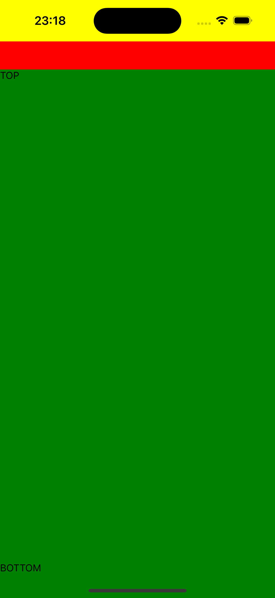

*** Usage example: ***

;

```tsx
import React, { FC } from 'react';
import { StyleSheet, Text, View } from 'react-native';
import { ScreenContainer } from './modules/components/screenContainer';
import { SafeAreaProvider } from 'react-native-safe-area-context';

const App: FC = () => {

  return (
    <SafeAreaProvider>
      <ScreenContainer
        scrollEnabled
        isScreenLoading={false}
        isLoading={false}
        edges={['top']}
        insets={['bottom']}
        containerBackground='green'
        rootContainerBackground='yellow'
        headerComponent={<View style={{ backgroundColor: 'red', height: 40 }} />}
      >
        <View style={{ flex: 1, justifyContent: 'space-between' }}>
          <Text>TOP</Text>
          <Text>BOTTOM</Text>
        </View>
        {/* {Array.from(Array(81).keys()).map((item, index) => <Text key={index}>{index}. Dimon Izhevsky</Text>)} */}
      </ScreenContainer>
    </SafeAreaProvider >
  );
}

export default App;

```